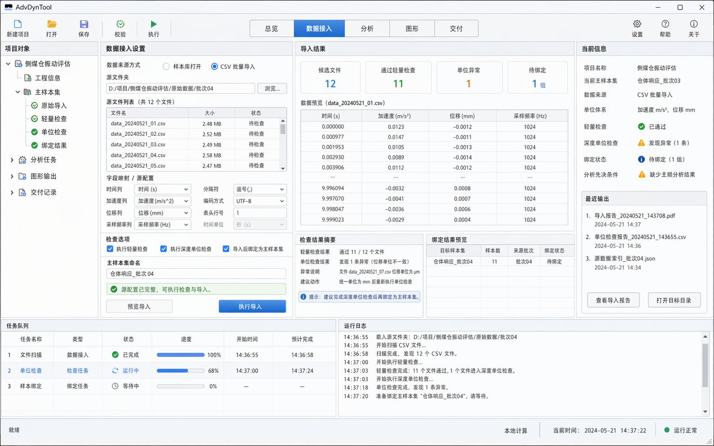
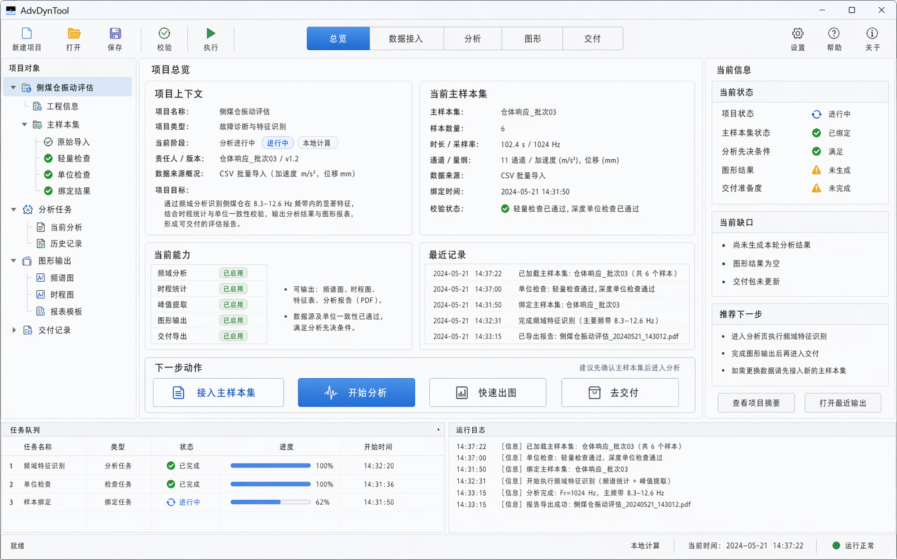
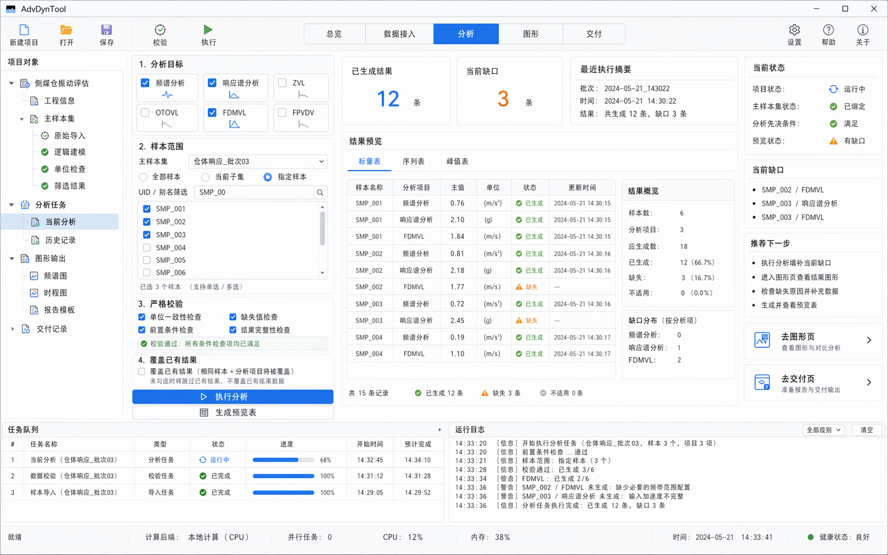
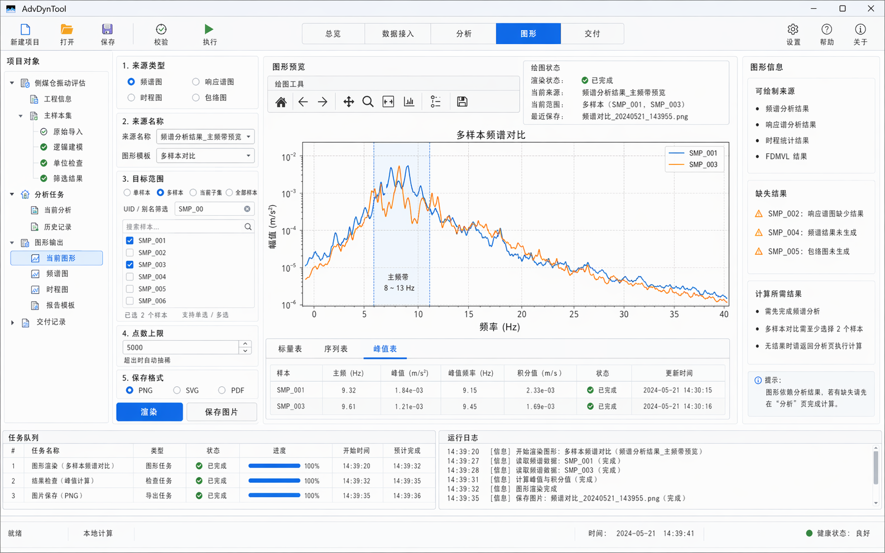

# GUI 视觉参考

稳定性：`Internal API`

本页用于沉淀当前 AdvDynTool GUI 的外部视觉参考图，作为后续 `theme`、组件样式、页面布局和 Matplotlib 绘图页落地时的统一对照面。

## 作用边界

- 这些图片是 GUI 视觉基线，不是逐像素实现合同。
- 页面结构、任务主线、对象层级仍以 `src/dyntool_gui/` 当前工作台实现和 `docs/developer/gui_skeleton.md` 为准。
- `theme = 可复用的视觉令牌与控件样式规则`。
- `hook = 把 theme 注入 Qt Widgets、Matplotlib 画布和工具栏的接入点`。

## 当前已固定的视觉方向

- Windows 桌面工作台风格，保持 `QMainWindow + QDockWidget + QStackedWidget` 的桌面感。
- 浅色蓝灰工程主题，强调紧凑、清晰、专业，不走消费级 SaaS 风格。
- 顶部固定为 `菜单栏 + 单行任务导航`；主工作台固定为 `左对象树 + 中央主工作区 + 底部任务/日志`。
- 页面命名按当前 4 页主导航组织：`总览 / 导入与筛选 / 数据处理 / 图形绘制`。
- 图形页允许更高的信息密度，但视觉仍必须统一到同一套卡片、边框、状态色、表格和按钮体系。
- 页面内状态摘要由各页主区承担，不再把右侧事实栏作为正式视觉合同。

## 对 theme 与 hook 的直接约束

- `ThemeTokens` 需要沉淀颜色、字号、边框、圆角、留白、状态色、表头、选中态和按钮层级。
- Qt Widgets 侧至少要有 `MainWindow`、`QDockWidget`、`QTreeView`、`QTableView`、`QTabWidget`、`QPushButton`、`QGroupBox` 的统一样式 hook。
- Matplotlib 侧需要独立 plot hook，统一轴颜色、网格、背景、图例、工具栏和状态提示，不直接复用普通 QSS。
- 参考图里的旧主工具栏、右侧事实栏和绘图型密集右栏，只能作为局部密度参考，不再作为正式结构合同。

## 参考图 01：任务型工作台总体风格

用于固定整体风格方向：浅色工程桌面、顶部任务导航、卡片化工作区、左右侧栏与底部记录区共存。

## 参考图 02：导入与筛选页密度与卡片分区

用于固定导入与筛选页的卡片密度、边框语气和分区关系；右侧事实栏表达不再照搬。

## 参考图 03：分析页结构参考

用于固定分析页的动作区、摘要区和预览区关系，避免重新退回上下大堆叠；参考重点是“参数与结果分区”，不是编号式向导结构。

## 参考图 04：图形页宽画布布局参考

用于固定图形页“画布优先”的工作方式，中央主结果区必须占主导。

## 参考图 05：结果整理与导出记录风格

用于固定结果整理与导出记录区域的布局语气：参数清楚、结果清楚、记录清楚，不做花哨装饰。

## 参考图 06：当前图形页综合稿

这张图最接近“当前项目可直接转成 theme + hook 目标”的状态，但只对 `图形` 页有效，重点可直接提炼：

- 左侧对象树和图形控制栏并存。
- 中央画布区必须成为主焦点。
- 底部结果页签和全局任务区可以并存，但不能用页内任务块重复底部任务区。
- 同一页面内需要统一按钮主次、分组框边框、表格表头、状态色和 Matplotlib 工具栏外观。

## 参考图拆分规则

- 绘图软件参考只作用于 `图形` 页。
- `总览 / 导入与筛选 / 数据处理` 优先参考轻量工程表单页和工作台页，不直接套用绘图器布局。
- 参考图只能决定密度、卡片语气、分栏比例，不能反向决定业务对象模型。

## 使用规则

- 后续 GUI 视觉调整先对照本页，不再反复切换整套风格方向。
- 组件级变更优先沉淀到 `src/dyntool_gui/theme.py`，避免把样式散落到各 widget。
- 图形页相关样式调整必须同时检查 Qt 主题和 Matplotlib 主题，不允许只改其中一侧。
