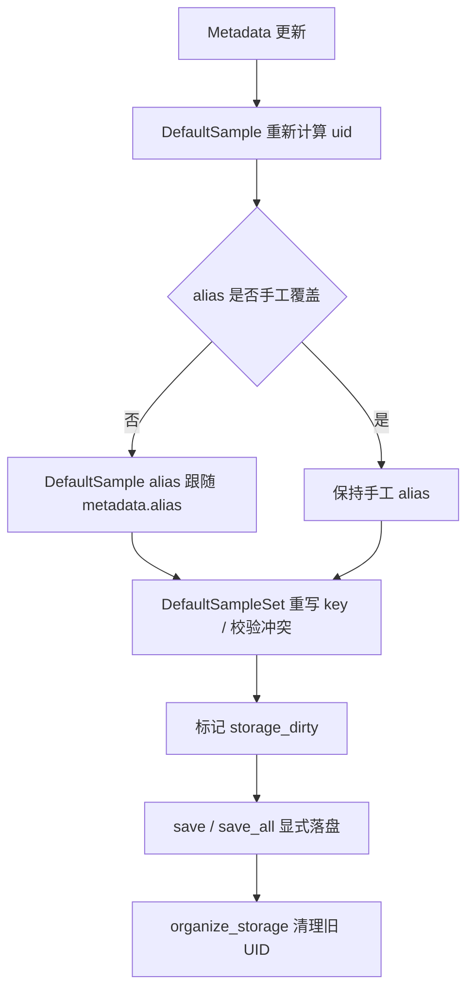

# DefaultSample / DefaultSampleSet 运行流程

稳定性：`Internal API`

说明：本文中的“样本 / 样本集”如果没有单独指向扩展类型，默认都对应内置正式对象
`DefaultSample / DefaultSampleSet`。公开导入路径应优先使用顶层 `dyntool` 或 `dyntool.storage`。

## 主流程总览

## 各层职责

### `MetadataBase`

- 负责 `uid` 与 `alias` 的生成规则
- 负责在字段赋值和 `update(...)` 时触发 change callback
- 不直接管理样本集索引

### `SampleBase`

- 聚合 metadata 与样本数据项
- 负责 alias 覆盖状态：
  - 自动 alias
  - 手工 alias
  - 显式强制回退
- 负责把 metadata 变化转成：
  - 新 `uid`
  - 新 alias
  - 向 `DefaultSampleSet` 回调 identity 变化
- 负责样本级懒加载：
  - 正式公共导入路径使用 `dyntool.storage.SampleLoadMode.LAZY`
  - 正式公共导入路径使用 `dyntool.storage.SampleLoadMode.METADATA_ONLY`
  - `ensure_loaded(...)`
  - `unload(...)`

### `SampleSetBase`

- 负责按 `uid` 管理样本
- 负责查询、批量更新和批量加载
- 负责在样本 metadata 变化后：
  - 重写 key
  - 检查 UID 冲突
  - 标记 `storage_dirty`
- 负责把公开 `categories` 规整为内部 `SampleField`，再路由到存储层读写目标

### `SampleSetStorage`

- 负责实际持久化
- 负责按 scheme 路由到底层策略
- 负责样本级 `load_sample(...)` 与集合级 `load_all(...)`
- `save_all()` 写当前状态
- `organize()` 清理不再属于当前样本集的冗余 UID 条目
- `SET_SQLITE_H5` 下由 SQLite 维护 metadata / presence 索引，H5 仅维护真实 payload

## alias 规则

### metadata alias

- `MetadataBase.build_alias()` 默认返回 `uid`
- `VibrationTestMetadata.build_alias()` 生成标准业务 alias
- `from_alias()` 只在明确支持的 metadata 子类上实现

### sample alias

优先级固定为：

1. 手工 `set_alias(...)`
2. `metadata.alias`

普通刷新只更新自动 alias。  
显式强制刷新会覆盖手工 alias，并回到 `metadata.alias`。

## 加载模式如何协同

### `METADATA_ONLY`

- `DefaultSampleSet.from_storage(..., load_mode=METADATA_ONLY)` 只构造样本壳对象
- 访问未加载槽位会抛错
- 适合只做查询、投影和 metadata 修补

### `LAZY`

- 先构造样本壳对象
- 首次读取 `sample.accel` 之类的 storage slot 时自动 `ensure_loaded()`
- 适合大样本集按需读盘

### `EAGER`

- 立即加载声明目标槽位
- 适合紧接着要做批量计算

## 公开方法与内部方法的边界

### 公开方法

- 面向用户，必须稳定
- 参数和返回值必须完整标注
- docstring 必须解释实际行为、副作用和错误条件

### 内部方法

- 以 `_` 开头
- 只服务于 identity 同步、存储绑定和批处理编排
- 不写进用户文档导航，只在开发者文档说明

### 当前关键内部方法

- `SampleBase._sync_identity_state(...)`
- `SampleBase._set_alias_internal(...)`
- `SampleBase._replace_data_var_internal(...)`
- `SampleSetBase._bind_sample_internal(...)`
- `SampleSetBase._on_sample_metadata_changed(...)`
- `SampleSetBase._on_sample_identity_changed(...)`

## 为什么不能再靠直写

`sample.accel = ...`、`sample.metadata = ...`、`sampleset[uid] = sample` 的问题是：

- 无法统一标记 `storage_dirty`
- 无法统一维护 alias 覆盖状态
- metadata 改名后容易漏掉样本集重索引
- 会把持久化、内存状态和查询索引拆成多套事实来源

因此当前实现要求所有正式路径都回到聚合层方法。 
## 参数与字段补充

- `case`：工况编号，用于区分不同加载工况或试验场景。
- `point`：测点编号，表示传感器或观测位置。
- `instr`：仪器编号，表示采集通道或设备标识。
- `dir`：方向编号，表示测量方向或轴向标识。
- `record`：记录编号，表示同一工况下的记录序号。
- `timestamp`：采样开始时间或记录时间戳。
- `extra`：附加业务信息，不参与标准 identity。
- 对保留的开放参数必须写清支持键，不允许把“透传给底层”当成最终契约。

## `sqlite_h5_v2` 内部实验结论

稳定性：`Private / implementation detail`

- `sqlite_h5_v2` 的实验已经完成，结论是“`metadata_json` 作为唯一完整 metadata 源”可以显著改善写入速度和仓库体积。
- 该实验结果已经收敛进正式 `SET_SQLITE_H5 v2`，因此不再维护独立的实验运行时分派。
- 当前仍保留少量私有 helper，仅用于 benchmark 和旧版 `v1` 基线验证。
- 当前私有入口位于 `sample_storage_sqlite_h5.py`，仅供 benchmark 脚本调用；只有真实大仓库 A/B 结果明确优于 current 时，才会继续进入正式迁移设计。
## `SET_SQLITE_H5` v2 存储格式说明

稳定性：`Internal API`

- 当前正式 `SET_SQLITE_H5` 已完成 `v2` 正式化。
- `v2` 只保留 `sample.metadata_json` 作为完整 metadata 源，不再维护 `sample_metadata_flat` 或 metadata lookup 表。
- 旧版 `v1` 仓库在连接时会自动迁移到 `v2`；新版代码继续读取升级后的仓库，旧代码不保证兼容。
- `SampleSetBase.metadata_frame()` 的公开逻辑没有变化，仍优先走 storage 快路径；只是 `SET_SQLITE_H5 v2` 的 storage 快路径改为读取 `metadata_json` 后在 Python 侧展开。
- 后续若要继续优化 metadata 读取，应优先在 `metadata_json` 展开 helper 上增加会话内缓存或批量反序列化优化，而不是恢复 `sample_metadata_flat`。
